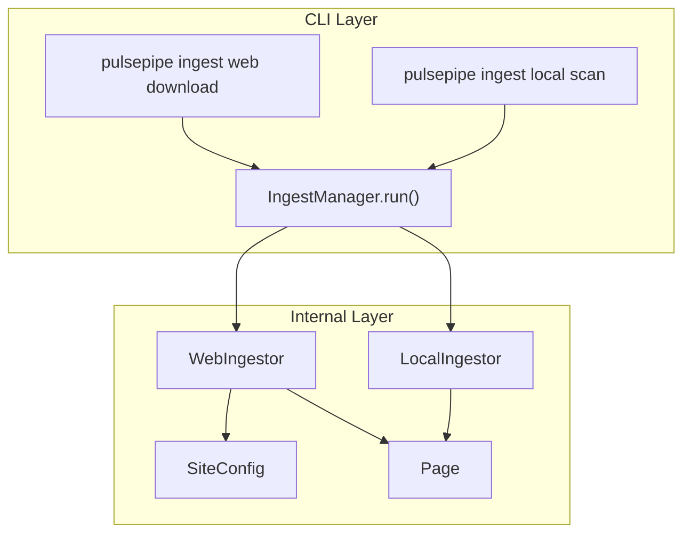
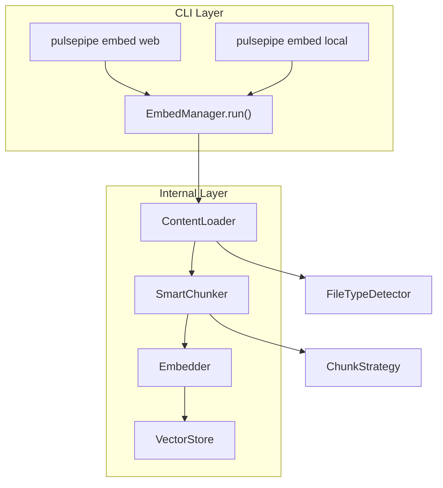
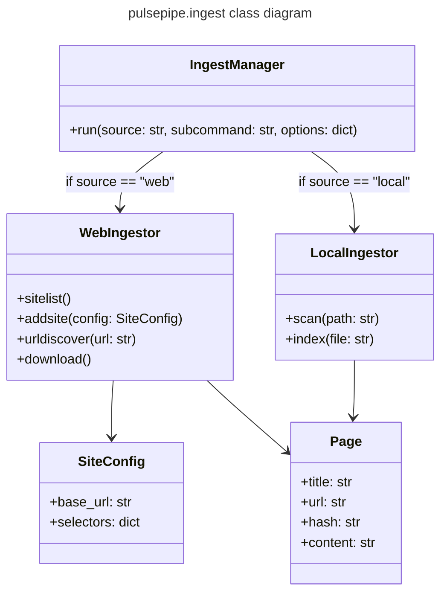
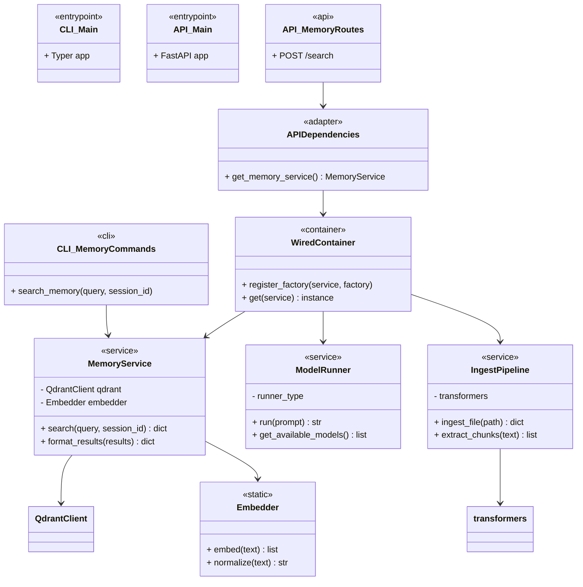

# pulsepipe

```python
python -m pulsepipe <commands> <subcommand> <options>
```

## main CLI commands /  pulsepipe "modes"

### ingest
ingest *source* *subcommand*



### embed

embed *source* *subcommands



## IngestManager



## new architecture

### Project Structure

```
src/
├── pulsepipe/                      # Root package
│   ├── __init__.py
│   │
│   ├── cli/                        # Typer CLI app
│   │   ├── __init__.py
│   │   ├── main.py                 # CLI entry point
│   │   ├── ingest/                 # CLI subcommand module
│   │   │   ├── __init__.py
│   │   │   ├── commands.py
│   │   │   └── helpers.py
│   │   ├── memory/
│   │   ├── model/
│   │   └── design/
│   │
│   ├── api/                        # FastAPI app
│   │   ├── __init__.py
│   │   ├── main.py                 # FastAPI entry point
│   │   ├── dependencies.py         # Wired adapters for FastAPI
│   │   ├── ingest/                 # API route module
│   │   │   ├── __init__.py
│   │   │   ├── routes.py
│   │   │   └── schemas.py
│   │   ├── memory/
│   │   ├── model/
│   │   └── design/
│   │
│   ├── core/                       # Shared logic (used by CLI + API)
│   │   ├── __init__.py
│   │   ├── ingest.py
│   │   ├── memory.py
│   │   ├── model.py
│   │   ├── design.py
│   │   ├── config.py               # Central config loader
│   │   └── container.py            # Wired DI container bootstrap
│   │
│   ├── crawler/                    # Pulsepipe ingestion tools
│   │   ├── __init__.py
│   │   ├── pulsepipe.py            # Entry point for crawling workflows
│   │   ├── page.py                 # Page object: HTML, markdown, image URLs
│   │   ├── extractor.py            # HTML → Markdown + image URL extraction 
│   │   ├── storage.py              # SQLite interface
│   │   ├── transformers.py
│   │   └── filetypes/
│   │       ├── markdown.py
│   │       ├── code.py
│   │       └── pdf.py
│   │
│   ├── db/                         # Memory + vector store layer
│   │   ├── __init__.py
│   │   ├── qdrant.py
│   │   ├── mem0.py
│   │   ├── schema.py
│   │   └── cache.py
│   │
│   ├── agents/                     # Optional: agent personas or plugins
│   │   ├── __init__.py
│   │   ├── planner.py
│   │   ├── executor.py
│   │   └── persona/
│   │       ├── designer.py
│   │       ├── researcher.py
│   │       └── coder.py
│   │
│   ├── tests/                      # Test suite
│   │   ├── __init__.py
│   │   ├── conftest.py             # Pytest fixtures
│   │   ├── test_core/
│   │   │   ├── test_memory.py
│   │   │   ├── test_ingest.py
│   │   ├── test_cli/
│   │   │   ├── test_commands.py
│   │   ├── test_api/
│   │   │   ├── test_routes.py
│   │   └── mocks/
│   │       ├── mock_qdrant.py
│   │       └── mock_embedder.py
│   │
│   └── __main__.py                 # Entry point for `python -m pulsepipe`
```

### Class Graph

