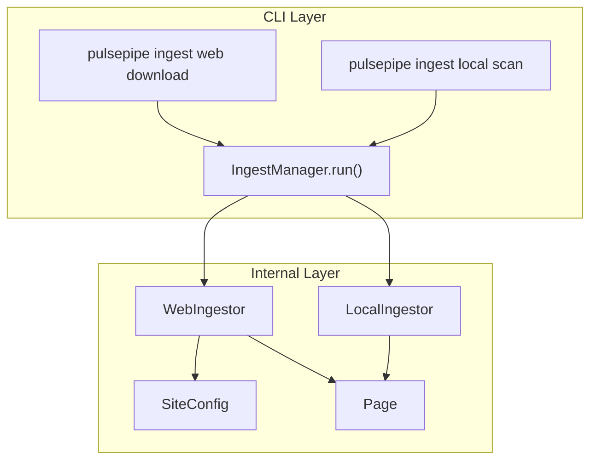
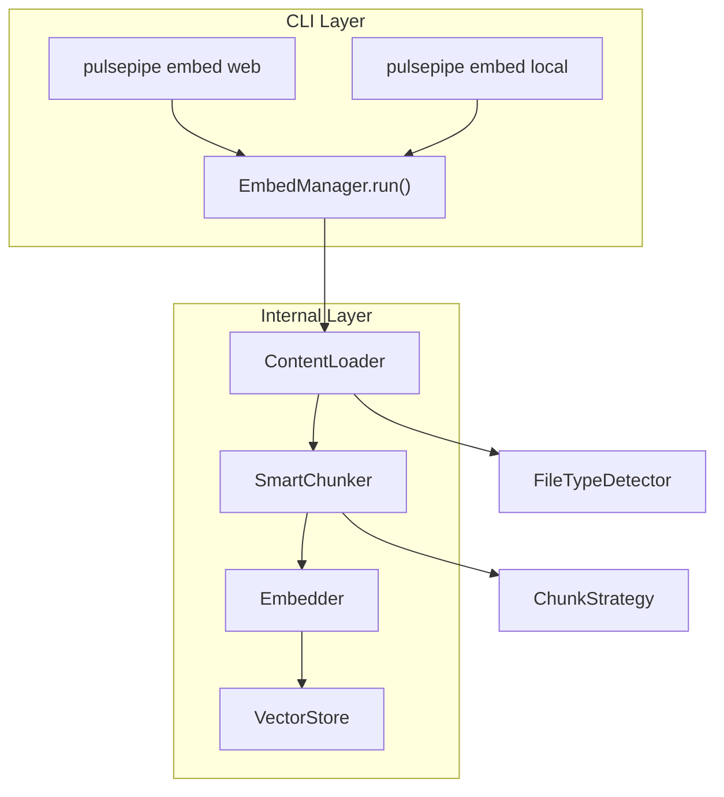
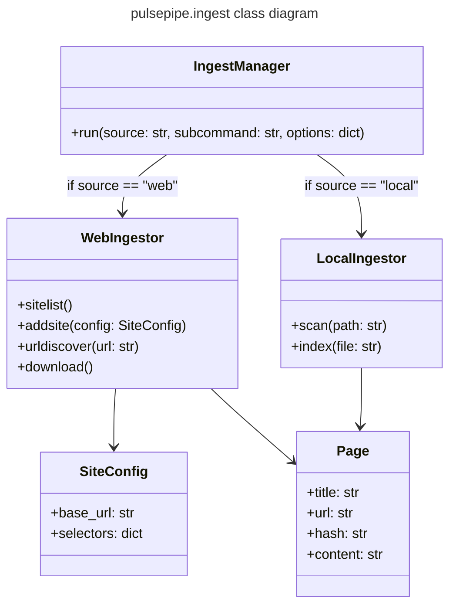

# pulsepipe

```python
python -m pulsepipe <commands> <subcommand> <options>
```

## main CLI commands /  pulsepipe "modes"

### ingest
ingest *source* *subcommand*



### embed

embed *source* *subcommands



## IngestManager

